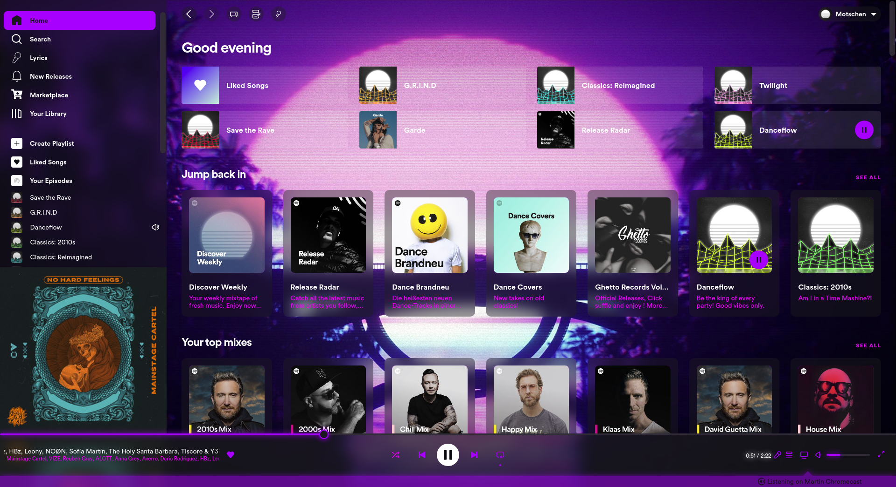
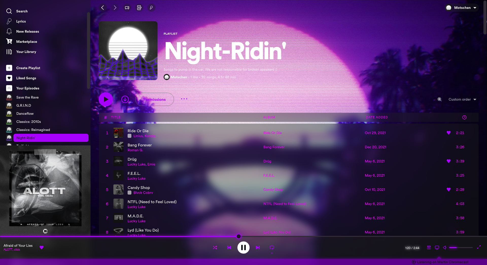
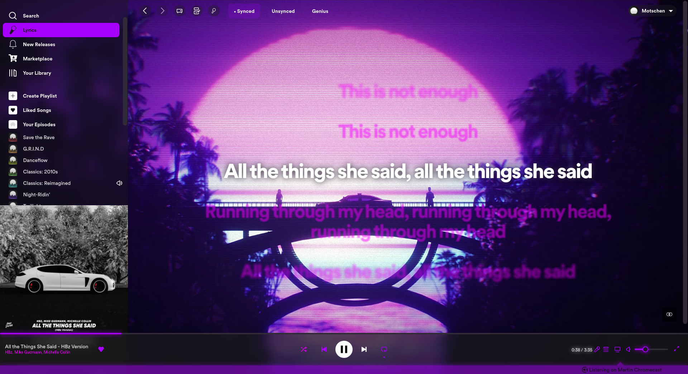
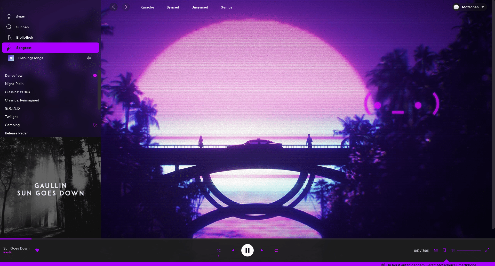

<h1 align="center">purple_Lines</h1>

Modified version of Retroblur Spicetify theme. 
Based on https://github.com/Motschen/Retroblur  
 

 

[Preview of the color variations](COLORS.md)

To change the color of the background, edit the link on the first line of user.css  
It's sadly not possible to change the background together with the color scheme automatically due to the limitations of CSS.
 

